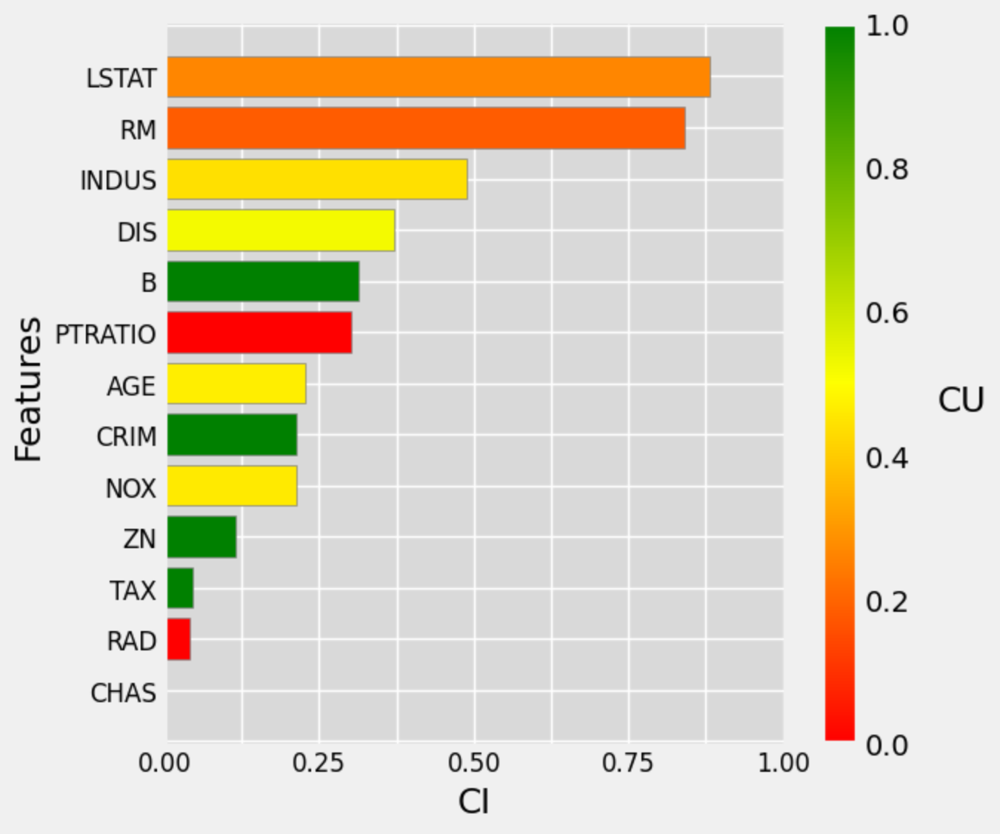
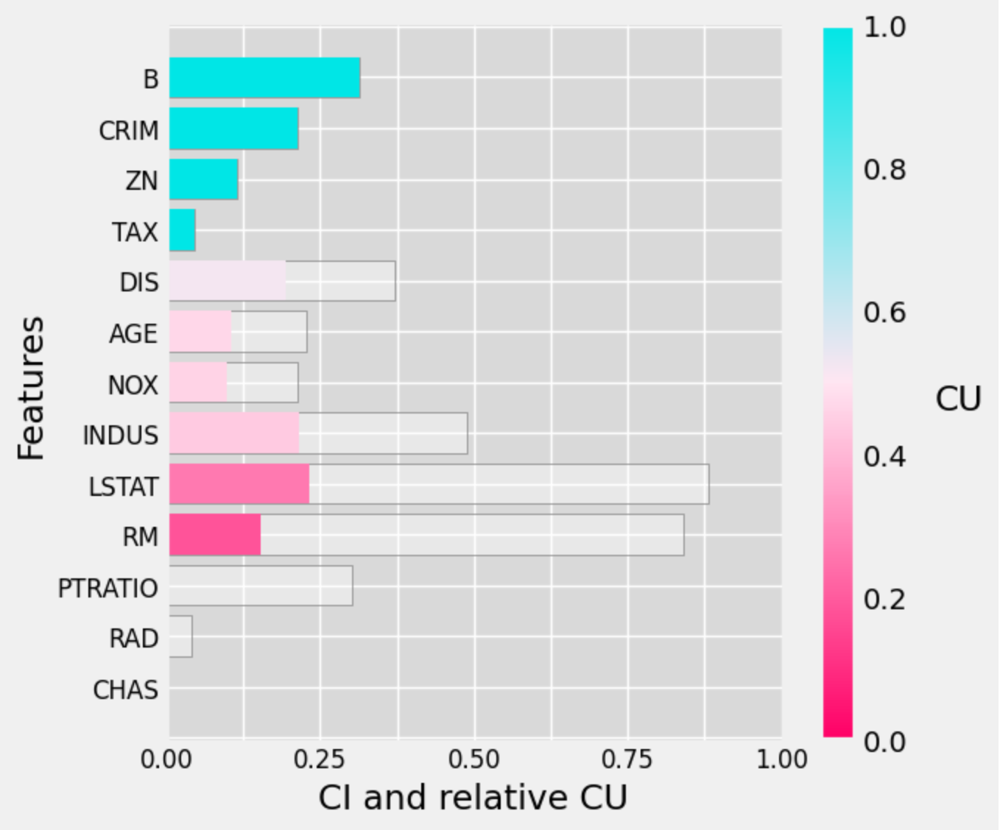
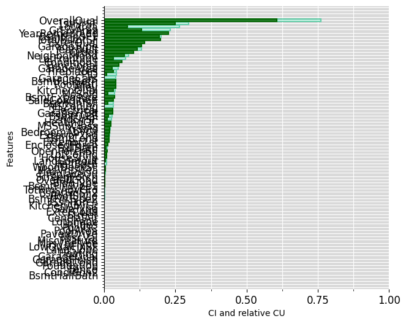
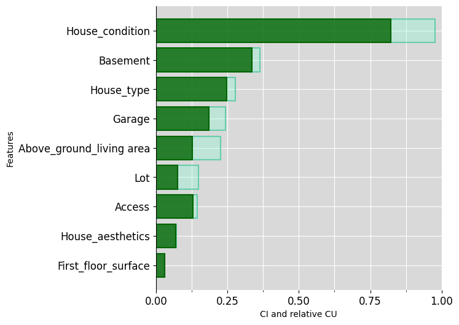
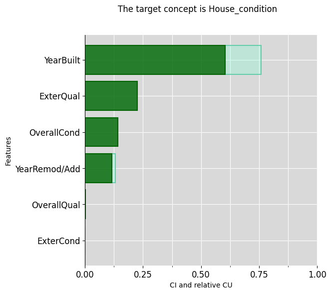
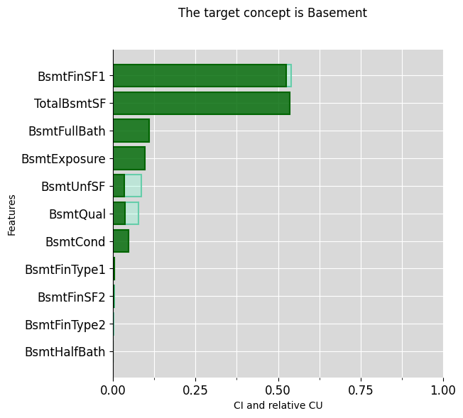
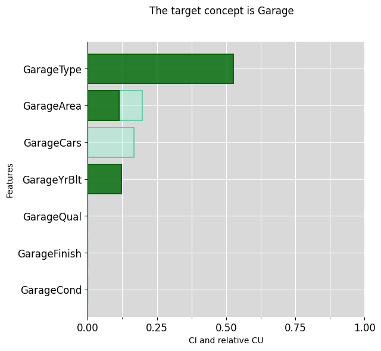

# py-ciu

*Explainable Machine Learning through Contextual Importance and Utility*

**NOTE: This python implementation is currently a work in progress. As such some of the functionality present in the original R version is not quite yet available.**

The *py-ciu* library provides methods to generate post-hoc explanations for
machine learning-based classifiers.

# What is CIU?

**Remark**: It seems like Github Markdown doesn’t show correctly the “{”
and “}” characters in Latex equations, whereas they are shown correctly
in Rstudio. Therefore, in most cases where there is an $i$ shown in
Github, it actually signifies `{i}` and where there is an $I$ it
signifies `{I}`.

CIU is a model-agnostic method for producing outcome explanations of
results of any “black-box” model `y=f(x)`. CIU directly estimates two
elements of explanation by observing the behaviour of the black-box
model (without creating any “surrogate” model `g` of `f(x)`).

**Contextual Importance (CI)** answers the question: *how much can the
result (or the utility of it) change as a function of feature* $i$ or a
set of features $\{i\}$ jointly, in the context $x$?

**Contextual Utility (CU)** answers the question: *how favorable is the
value of feature* $i$ (or a set of features $\{i\}$ jointly) for a good
(high-utility) result, in the context $x$?

CI of one feature or a set of features (jointly) $\{i\}$ compared to a
superset of features $\{I\}$ is defined as

$$
\omega_{j,\{i\},\{I\}}(x)=\frac{umax_{j}(x,\{i\})-umin_{j}(x,\{i\})}{umax_{j}(x,\{I\})-umin_{j}(x,\{I\})},  
$$

where $\{i\} \subseteq \{I\}$ and $\{I\} \subseteq \{1,\dots,n\}$. $x$
is the instance/context to be explained and defines the values of input
features that do not belong to $\{i\}$ or $\{I\}$. In practice, CI is
calculated as:

$$
\omega_{j,\{i\},\{I\}}(x)= \frac{ymax_{j,\{i\}}(x)-ymin_{j,\{i\}}(x)}{ ymax_{j,\{I\}}(x)-ymin_{j,\{I\}}(x)}, 
$$

where $ymin_{j}()$ and $ymax_{j}()$ are the minimal and maximal $y_{j}$
values observed for output $j$.

CU is defined as

$$
CU_{j,\{i\}}(x)=\frac{u_{j}(x)-umin_{j,\{i\}}(x)}{umax_{j,\{i\}}(x)-umin_{j,\{i\}}(x)}. 
$$

When $u_{j}(y_{j})=Ay_{j}+b$, this can be written as:

$$
CU_{j,\{i\}}(x)=\left|\frac{ y_{j}(x)-yumin_{j,\{i\}}(x)}{ymax_{j,\{i\}}(x)-ymin_{j,\{i\}}(x)}\right|, 
$$

where $yumin=ymin$ if $A$ is positive and $yumin=ymax$ if $A$ is
negative.
## Usage

First, install the required dependencies. NOTE: this is to be run in your environment's terminal; 
some environments such as Google Colab might require an exclamation mark before the command, such as `!pip install`.

```
pip install py-ciu
```

Import the library:

```python
from ciu import determine_ciu
```

Now, we can call the ``determine_ciu`` function which takes the following parameters:

* ``case``: A dictionary that contains the data of the case.


* ``predictor``: The prediction function of the black-box model *py-ciu* should
                 call.

* ```dataset```: Dataset to deduct min_maxs from (dictionary).
                            Defaults to ``None``.

* ``min_maxs`` (optional): dictionary (``'feature_name': [min, max, is_int]`` for each feature),
                    or infered from dataset. Defaults to ``None``
* 
* ``samples`` (optional): The number of samples *py-ciu* will generate. Defaults
                          to ``1000``.

* ``prediction_index`` (optional): In case the model returns several
                                   predictions, it is possible to provide the
                                   index of the relevant prediction. Defaults to
                                   ``None``.
                                   
* ``category_mapping`` (optional): A mapping of one-hot encoded categorical
                                   variables to lists of categories and category
                                   names. Defaults to ``None``.
                                   
* ``feature_interactions`` (optional): A list of ``{key: list}`` tuples of
                                       features whose interactions should be
                                       evaluated. Defaults to ``[]``.

Here we can use a simple example with the well known Iris flower dataset
```python
import pandas as pd
import numpy as np
from sklearn.model_selection import train_test_split
from sklearn import datasets
from sklearn.discriminant_analysis import LinearDiscriminantAnalysis

iris=datasets.load_iris()

df = pd.DataFrame(data = np.c_[iris['data'], iris['target']],
              columns = iris['feature_names'] + ['target'])
df['species'] = pd.Categorical.from_codes(iris.target, iris.target_names)
df.columns = ['s_length', 's_width', 'p_length', 'p_width', 'target', 'species']

X = df[['s_length', 's_width', 'p_length', 'p_width']]
y = df['species']
X_train, X_test, y_train, y_test = train_test_split(X, y, test_size=0.3, random_state=123)
```

Then create and train a model, in this case an `LDA` model
```python
model = LinearDiscriminantAnalysis()
model.fit(X_train, y_train)
```

Now simply use our Iris flower data and the model, following the parameter descriptions above
```python
iris_df = df.apply(pd.to_numeric, errors='ignore')

iris_ciu = determine_ciu(
    X_test.iloc[[42]],
    model.predict_proba,
    iris_df.to_dict('list'),
    samples = 1000,
    prediction_index = 2
)
```
## Example Output

Let's import a test from the ciu_tests file

```python
from ciu_tests.boston_gbm import get_boston_gbm_test
```

The ```get_boston_gbm_test``` function returns a CIU Object that we can simply store and use as such
```python
boston_ciu = get_boston_gbm_test()
boston_ciu.explain_tabular()
```

Now we can also plot the CI/CU values using the CIU Object's ``plot_ciu`` function

```python
boston_ciu.plot_ciu()
```

Likewise there are also several options available using the following parameters:

* ``plot_mode``: defines the type plot to use between 'default', 'overlap' and 'combined'.            
* ``include``: defines whether to include interactions or not.                                        
* ``sort``: defines the order of the plot bars by the 'ci' (default), 'cu' values or unsorted if None.
* ``color_blind``: defines accessible color maps to use for the plots, such as 'protanopia',          
                                   'deuteranopia' and 'tritanopia'.                           
* ``color_edge_cu``: defines the hex or named color for the CU edge in the overlap plot mode.         
* ``color_fill_cu``: defines the hex or named color for the CU fill in the overlap plot mode.         
* ``color_edge_ci``: defines the hex or named color for the CI edge in the overlap plot mode.         
* ``color_fill_ci``: defines the hex or named color for the CI fill in the overlap plot mode.         

Here's quick example using some of these parameters to create a modified version of the above plot 
```python
boston_ciu.plot_ciu(plot_mode="combined", color_blind='tritanopia', sort='cu')
```


## Intermediate Concepts
CIU can use named feature coalitions and structured vocabularies. 
Such vocabularies allow explanations at any abstraction level and can make explanations interactive.

###Ames Housing Example
Ames housing is a data set about properties in the town Ames in the US. 
It contains over 80 features that can be used for learning to estimate the sales price. 
The following code imports the data set, does some pre-processing and trains a Gradient Boosting model:
```python
from ciu.ciu_core import determine_ciu
import pandas as pd
import xgboost as xgb
from sklearn.model_selection import train_test_split

df = pd.read_csv('AmesHousing.csv')

#Checking for missing data
missing_data_count = df.isnull().sum()
missing_data_percent = df.isnull().sum() / len(df) * 100

missing_data = pd.DataFrame({
    'Count': missing_data_count,
    'Percent': missing_data_percent
})

missing_data = missing_data[missing_data.Count > 0]
missing_data.sort_values(by='Count', ascending=False, inplace=True)

#This one has spaces for some reason
df.columns = df.columns.str.replace(' ', '')


#Taking care of missing values
from sklearn.impute import SimpleImputer
# Group 1:
group_1 = [
    'PoolQC', 'MiscFeature', 'Alley', 'Fence', 'FireplaceQu', 'GarageType',
    'GarageFinish', 'GarageQual', 'GarageCond', 'BsmtQual', 'BsmtCond',
    'BsmtExposure', 'BsmtFinType1', 'BsmtFinType2', 'MasVnrType'
]
df[group_1] = df[group_1].fillna("None")

# Group 2:
group_2 = [
    'GarageArea', 'GarageCars', 'BsmtFinSF1', 'BsmtFinSF2', 'BsmtUnfSF',
    'TotalBsmtSF', 'BsmtFullBath', 'BsmtHalfBath', 'MasVnrArea'
]

df[group_2] = df[group_2].fillna(0)

# Group 3:
group_3a = [
    'Functional', 'MSZoning', 'Electrical', 'KitchenQual', 'Exterior1st',
    'Exterior2nd', 'SaleType', 'Utilities'
]

imputer = SimpleImputer(strategy='most_frequent')
df[group_3a] = pd.DataFrame(imputer.fit_transform(df[group_3a]), index=df.index)

df.LotFrontage = df.LotFrontage.fillna(df.LotFrontage.mean())
df.GarageYrBlt = df.GarageYrBlt.fillna(df.YearBuilt)

#Label encoding
from sklearn.preprocessing import LabelEncoder
df = df.apply(LabelEncoder().fit_transform)

data = df.drop(columns=['SalePrice'])
target = df.SalePrice

#Splitting and training
X_train, X_test, y_train, y_test = train_test_split(data, target, test_size=0.3, random_state=123)
xg_reg = xgb.XGBRegressor(objective ='reg:squarederror', colsample_bytree = 0.5, learning_rate = 0.1, max_depth = 15, alpha = 10)

xg_reg.fit(X_train,y_train)
```
Then we create our vocabulary of intermediate concepts, in this case a list containing dictionaries of a `concept->[columns]`structure as follows:
```python
intermediate = [
    {"Garage":list(df.columns[[58,59,60,61,62,63]])},
    {"Basement":list(df.columns[[30,31,33,34,35,36,37,38,47,48]])},
    {"Lot":list(df.columns[[3,4,7,8,9,10,11]])},
    {"Access":list(df.columns[[13,14]])},
    {"House_type":list(df.columns[[1,15,16,21]])},
    {"House_aesthetics":list(df.columns[[22,23,24,25,26]])},
    {"House_condition":list(df.columns[[17,18,19,20,27,28]])},
    {"First_floor_surface":list(df.columns[[43]])},
    {"Above_ground_living area":[c for c in df.columns if 'GrLivArea' in c]}
]
```
Now we can initialise the CIU object with a relatively favourable test case and our newly defined intermediate concepts:
```python
test_data_ames = X_test.iloc[[345]]

ciu = determine_ciu(
    test_data_ames,
    xg_reg.predict,
    df.to_dict('list'),
    samples = 1000,
    prediction_index = None,
    intermediate_concepts = intermediate
)
```
We start with an “explanation” using all 80 basic features, which is not very readable and overly detailed for “ordinary” humans to understand:
```python
ciu_ames.plot_ciu(include_intermediate_concepts='no', plot_mode='overlap')
```

Then the same, using highest-level concepts:
```python
ciu_ames.plot_ciu(include_intermediate_concepts='only', plot_mode='overlap')
```

Then explain further some intermediate concepts:
```python
ciu_ames.plot_ciu(target_concept="House_condition", plot_mode="overlap")
```

```python
ciu_ames.plot_ciu(target_concept="Basement", plot_mode="overlap")
```

```python
ciu_ames.plot_ciu(target_concept="Garage", plot_mode="overlap")
```


This vocabulary is just an example of what kind of concepts a human typically deals with. 
Vocabularies can be built freely (or learned, if possible) and used freely, even so that different vocabularies can be used with different users.
## Authors
* [Vlad Apopei](https://github.com/vladapopei/)

* [Kary Främling](https://github.com/KaryFramling)

The current version of py-ciu re-uses research code provided by [Timotheus Kampik](https://github.com/TimKam/) and replaces it. The old code is available in the branch "Historical".
